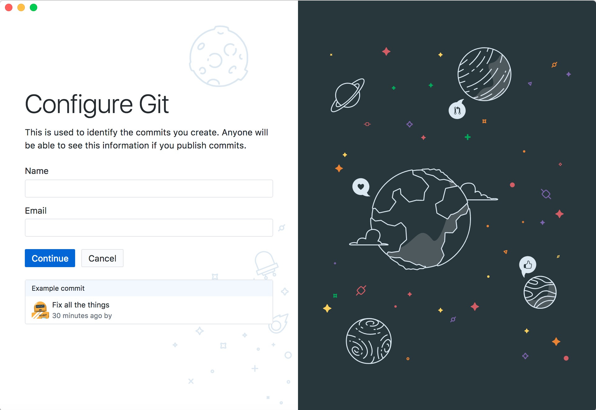
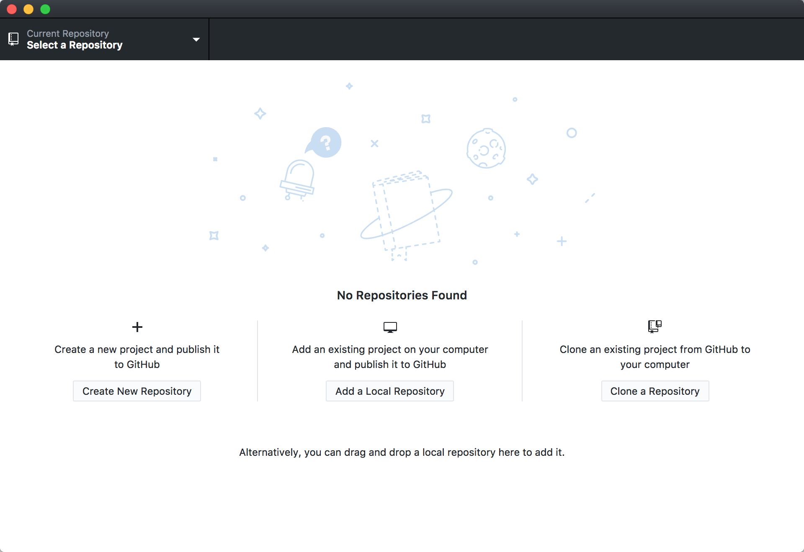
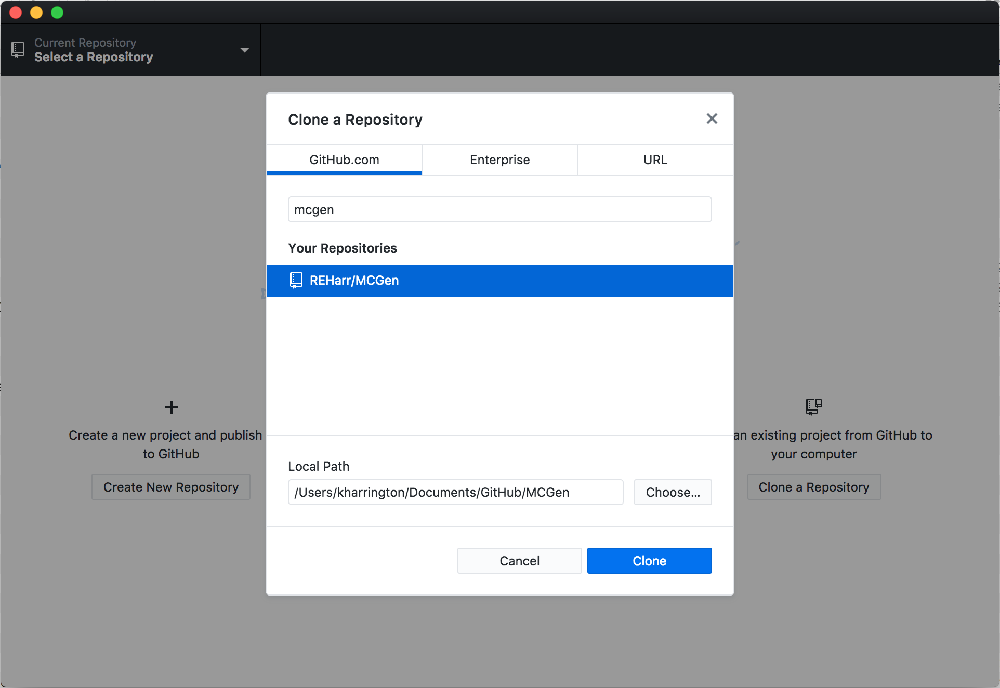
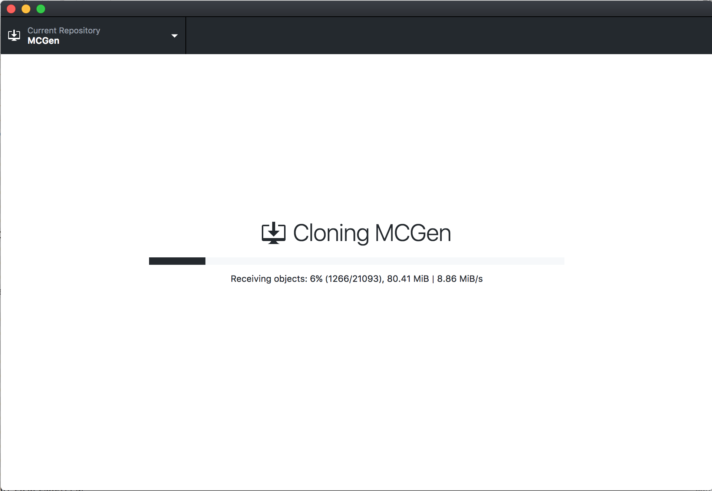
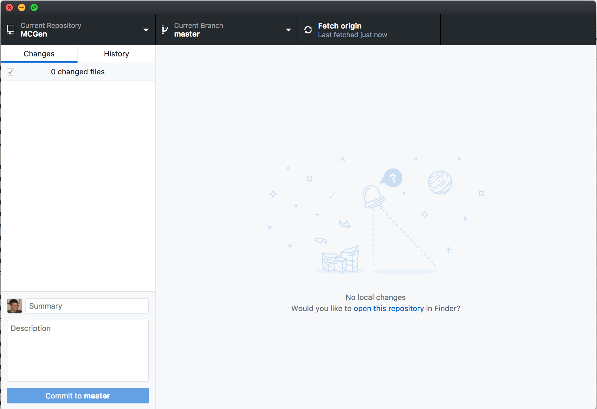
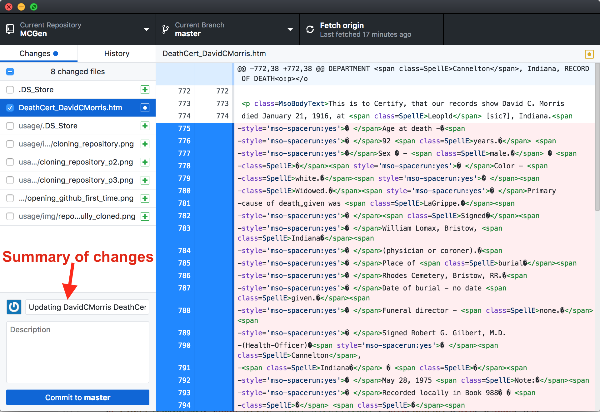
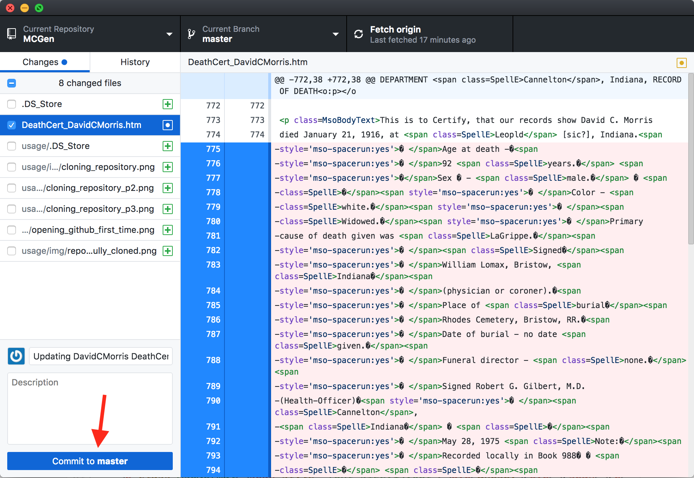
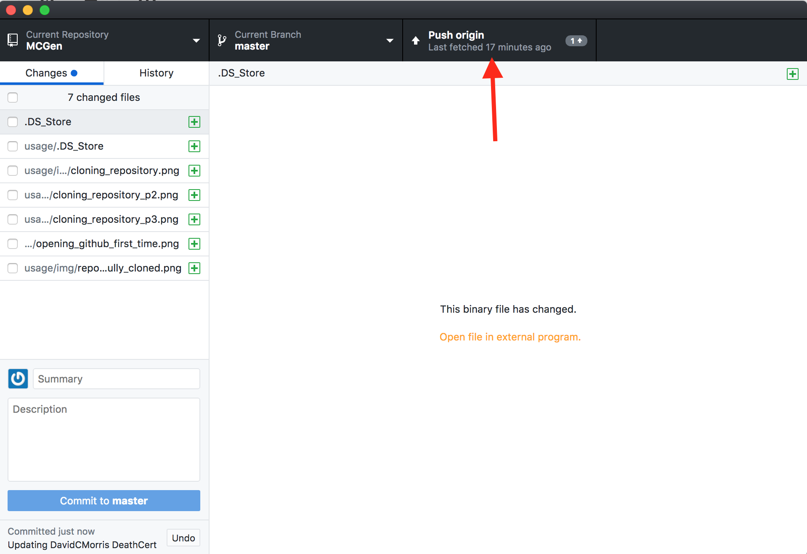

# First time setup

1. Sign up for a Github account: [https://github.com/join](https://github.com/join)
2. Send an email to [Richard Harrington](mailto:richardharrington31@gmail.com) asking him to add you to the MCGen github repository

## After hearing from Richard

1. Download Github Desktop: [https://desktop.github.com/](https://desktop.github.com/)
2. Run the installation program that you just downloaded
3. Open Github Desktop
4. The first screen you see will be:  
  
Enter your login information
5. Next, you will get a screen to configure git:
  
Enter your first and last name, and your email address  
6. Finally, you will get a screen to finish the configuration process:
  
Click Finish
7. After clicking finish, you will need to setup the MCGen repository:
  
Click `Clone a repository`
8. Now enter "MCGen" into the search bar to find the repository on Github:
  
Select the repository "REHarr/MCGen" and press "Clone"
9. It will take some time to download this. Please get a coffee and relax for a bit! The screen will look something like this while it downloads:
  
10. When the download is complete your screen will look like this:

# Editing an existing file:

1. Open Github Desktop
2. Click on the "Repository" menu, and select "Show in Explorer"
3. If editing an existing file, right-click on file and "Open with" > Microsoft Word
4. Enter summary of changes into the "Summary text box":

5. Press "commit"

6. Press "push origin"

# Adding a new file:

1. Open Github Desktop
2. Click on the "Repository" menu, and select "Show in Explorer"
3. Creating a new file with Microsoft Word, and save file into this directory
4. Enter summary of changes into the "Summary text box":

5. Press "commit"

6. Press "push origin"

